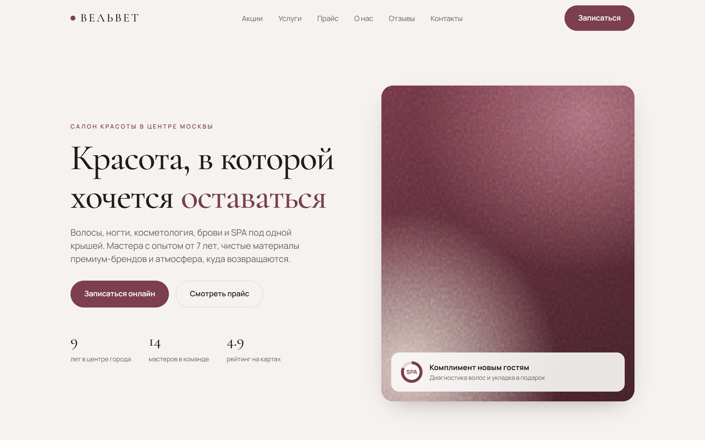
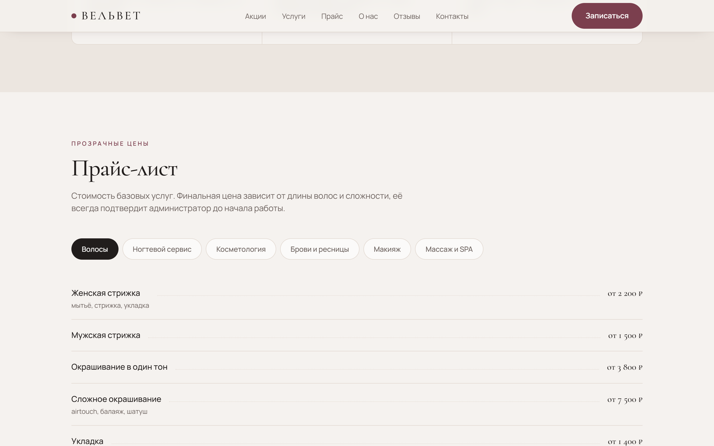
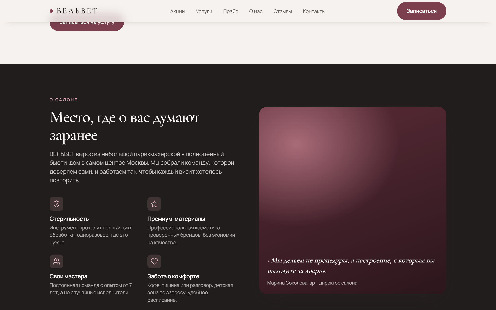
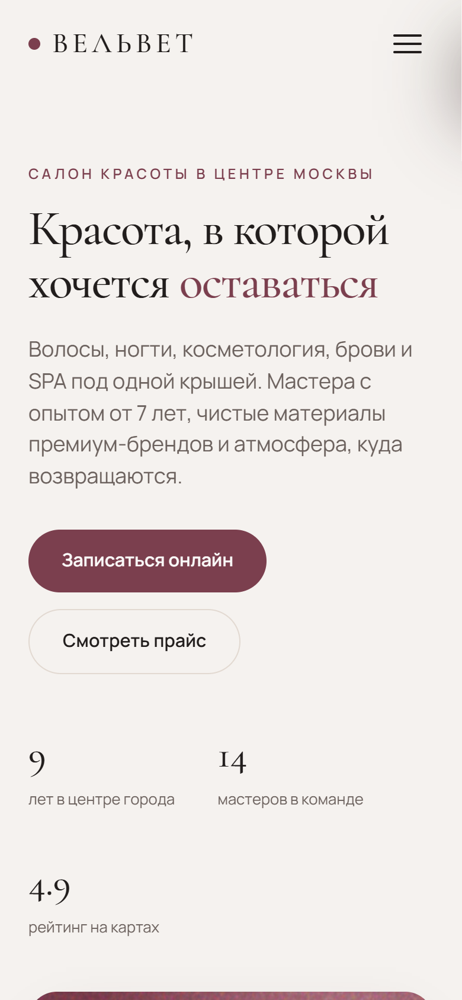

# ВЕЛЬВЕТ — лендинг салона красоты

Продающий одностраничник для салона красоты полного цикла. Цель — заявка на онлайн-запись.
Сделано как портфолио-проект по ТЗ. Данные салона вымышленные (демо для показа заказчикам).

🔗 **Живое демо:** https://velvet-salon-landing.vercel.app/


## ✨ Что внутри

- **9 блоков**: шапка, герой, акции, категории услуг, прайс (переключение направлений), о нас, отзывы, контакты + форма записи, футер
- **Вау-детали**: scroll-reveal появление секций, плавный скролл (Lenis), grain-градиенты и SVG вместо стоковых фото
- **Sticky-шапка** с уплотнением при скролле, **бургер-меню** (оверлей, закрытие по фону / Esc / клику)
- **Категории кликом** переключают нужную вкладку прайса и скроллят к ней
- **Форма записи** с валидацией (имя, телефон, согласие), состоянием отправки и экраном «Заявка принята»
- **Адаптив** mobile-first, плавающая CTA на мобильных, SEO-метаданные + OpenGraph + JSON-LD (`BeautySalon`)
- Уважение `prefers-reduced-motion`, семантика, a11y

## 🛠 Стек

| Слой | Технология |
|---|---|
| Фреймворк | Next.js 14 (App Router) |
| Язык | TypeScript |
| Стили | Tailwind CSS 3.4 |
| Анимации | Framer Motion + Lenis (smooth scroll) |
| Шрифты | Cormorant Garamond + Manrope (next/font, самохостинг) |
| Иконки | lucide-react |
| Картинки | CSS-градиенты и inline-SVG, без внешних хостов |

Свой дизайн-язык: палитра **вино + костяной + графит**, editorial-типографика. Не шаблон-конструктор.

## 🚀 Запуск

```bash
npm install      # установить зависимости
npm run dev      # дев-сервер → http://localhost:3000
npm run build    # production-сборка
npm run start    # запуск собранной версии
```

## 📁 Структура

```
src/
├── app/
│   ├── layout.tsx          # шрифты, метаданные, провайдер smooth-scroll
│   ├── page.tsx            # сборка секций + JSON-LD
│   ├── globals.css         # база + токены Tailwind
│   └── api/lead/route.ts   # приём заявки (заглушка под CRM-webhook)
├── components/
│   ├── sections/           # Hero, Promo, Categories, Pricing, About, Reviews, Contact, Footer
│   ├── layout/             # Navbar (+бургер), FloatingCTA
│   ├── animations/         # Reveal (scroll-reveal обёртка)
│   ├── providers/          # LenisProvider (smooth scroll + якоря)
│   └── ui/                 # SectionHeading, Icon
└── lib/
    ├── data.ts             # весь контент (в проде → CMS)
    └── utils.ts            # cn()
```

## 🖼 Скриншоты

| Десктоп | Прайс | О нас | Мобайл |
|---|---|---|---|
|  |  |  |  |

## 🔌 Точки расширения под боевую версию

В портфолио-версии всё автономно и бесплатно. Места для подключения помечены в коде:

- **Заявка** → `src/app/api/lead/route.ts` (сейчас логирует и возвращает ok): CRM-webhook (AmoCRM / Bitrix24), Telegram-бот администратора или сервис онлайн-записи (YCLIENTS).
- **Контент** (услуги, цены, контакты) → `src/lib/data.ts`.
- **Аналитика** (Я.Метрика / GA4) → добавляется в `src/app/layout.tsx`.
- Палитра и шрифты вынесены в `tailwind.config.ts` и `layout.tsx`.

## 🎯 Ориентиры из ТЗ

Конверсия «визит → заявка», Lighthouse (Performance / Accessibility / SEO) ≥ 90.
Скорость: SSG, самохостинг шрифтов, анимации только по `transform / opacity`, отсутствие тяжёлых ассетов.

ТЗ: [`_tz/`](_tz/).
